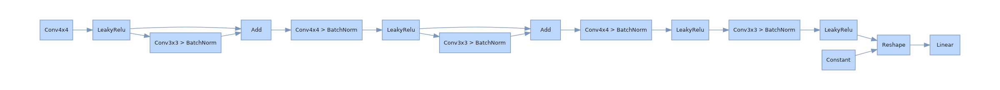
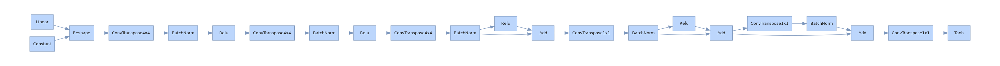
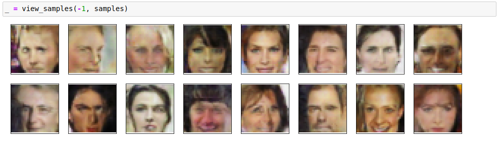

<h1 class="code-line" data-line-start=0 data-line-end=1 >28x28 pixel DCGAN face generator</h1>

AI to generate people faces. This project refers to udacity 4th project . Architecture is highly inspired by DCGAN paper, cycle GAN, resnets idea and GAN hacks.

<h1 class="code-line" data-line-start=5 data-line-end=6 >How to run</h1>
<ul>
<li class="has-line-data" data-line-start="6" data-line-end="7">clone my repo and open terminal inside <strong>dlnd_face_generation_project</strong>/ folder</li>
<li class="has-line-data" data-line-start="7" data-line-end="8">In terminal enter <code>conda env create -f environment.yml</code></li>
<li class="has-line-data" data-line-start="8" data-line-end="9">Now activate enviroment</li>
<li class="has-line-data" data-line-start="9" data-line-end="12">Use <code>python run.py -n 100</code> where -n is number of images to generate. 
Note , Generated images are saved in  <strong>generated_samples</strong>/ folder</li>
</ul>
<h3 class="code-line" data-line-start=12 data-line-end=13 >DCGAN Network architecture</h3>

Dillinger uses a number of open source projects to work properly:

<ul>
<li class="has-line-data" data-line-start="17" data-line-end="20">

Discriminator 

</li>
<li class="has-line-data" data-line-start="20" data-line-end="23">

Generator 

</li>
</ul>
<h3 class="code-line" data-line-start=23 data-line-end=24 >Results</h3>

Results can be found in generated_samples folder . Here is sample taken from my notebook. 

<h3 class="code-line" data-line-start=27 data-line-end=28 >More improvements to do</h3>
<ul>
<li class="has-line-data" data-line-start="28" data-line-end="29">use it on 64x64 or even larger sizes images</li>
<li class="has-line-data" data-line-start="29" data-line-end="31">Use different architecture</li>
</ul>
<h3 class="code-line" data-line-start=31 data-line-end=32 >References and Special Thanks to</h3>
<ul>
<li class="has-line-data" data-line-start="32" data-line-end="33">Udacity Deep learning nanodegree program</li>
<li class="has-line-data" data-line-start="33" data-line-end="34">GAN hacks by Soumith</li>
<li class="has-line-data" data-line-start="34" data-line-end="35">hiddenlayer visualizer by waleedka</li>
</ul>
